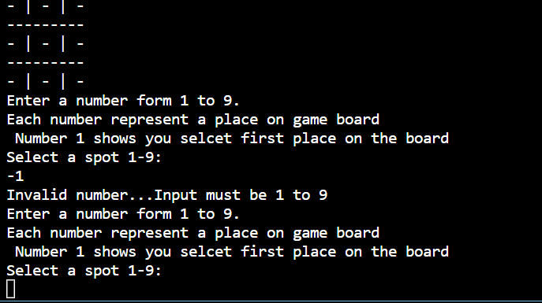

# TIC TAC TOE Game

The Tic Tac Toe Game is very popular and is quite simple in itself.
There will be one player in a game against the computer. Two signs represent each player. The general signs used in the game are X and O. Finally, there will be a  game board with 9 empty spaces.
## Here is live version of my project

Visit the deployed site: [Tic Tac Toe](https://game-tic-tac-toe-267668f1caeb.herokuapp.com/)
## User Experience (UX)

### User Stories

* As a user, I want to be able to understand how to play this game.all instructions are given in detail when start the game.
As a User, I want to be able to start a new game of Tic Tac Toe, so that I can begin playing from a fresh board.

* As a User, I want the game to indicate whose turn it is (X or O), so that I know when to make my move.

* As a User, I want the game to check and prevent illegal moves, such as placing a symbol on an already occupied spot, to ensure fair gameplay.

* As a User, I want the game to automatically switch turns between X and O after each move, so that the game progresses smoothly.

* As a User, I want the game to detect and announce a winner when a player has achieved a winning pattern (3 in a row, column, or diagonal), so that I know the game outcome.

* As a User, I want the game to detect and announce a Tie when there is no space left in a game board, so that I know the game outcome.

* As a User, I want the option to play again once a game is complete.

## How to Play

Tic-tac-toe (American English), noughts and crosses (Commonwealth English), or Xs and Os (Canadian or Irish English) is a paper-and-pencil game for two players who take turns marking the spaces in a three-by-three grid with X or O. The player who succeeds in placing three of their marks in a horizontal, vertical, or diagonal row is the winner. 
Step 1 - The tic tac toe game begins with empty cells in a square grid. This is the tic tac toe board.

Step 2 - First player will place their sign in one of the available empty boxes.

Step 3 - The second user computer will place their sign in one of the available empty boxes.

Step 4 - The goal of the players is to place their respective signs completely row-wise or column-wise, or diagonally.

Step 5 - The game goes on until a player wins the game or it ended up in a draw by filling all boxes without a winning match.

you can read more about this game on  [Wikipedie](https://en.wikipedia.org/wiki/Tic-tac-toe)

## Features
* The game start with the instructions how to play and displaying game board then ask the user inputting number from 1-9.Each number represent a place on game board.

* 

* user plays against computer.e.g
if user enter number 1 then "X" sign will takes first spot on the board.then computer place "O" sign randomly on the board automatically when user press enter after entering number.

* 

* Validation is also done in this game if user enter any other number rather then 1-9 or add any other letter or space is already occupied then user can see a clear error message on the screen which shows how to resolve this errror and game run again and again until user enters valid number.
### Validation Images
1- validation error when user enter any other number then 1-9

* 

2- validation error image when user enter any alphabate 

* 

3- validation error when user enter that number which is not empty.

* 

* Restar Game: When game ends user can see an option " Do you want to play again then according to user input game end or restart again.

1- if user enters "yes" game will restart. 

* 

2- if user enters "no" game will end. 

* 

## Tie
The game goes on until a player wins the game or it ended up in a draw by filling all boxes without a winning match.

* 

## Future Implementations

* Update the game with few challanges which makes the game more intresting.
* User can select any sign on his own choice.
* Player can play the game with his/her name.
* Add score board which can store both players scores

## Technologies Used

### Languages used
 * Python

### Frameworks, Libraries & Programs Used

[Github](https://github.com/) - To save and store the files for the game.

[GitPod](https://www.gitpod.io/) - IDE

[Am I Responsive?](http://ami.responsivedesign.is/) To show the website image on a range of devices.

[CI Python Linter](https://pep8ci.herokuapp.com/) For resolving code errors

## Testing

Testing was ongoing throughout the entire build. I have manually tested this game by doing folowing steps:

* Passed the code through PEP8 Linter and confirmed there are no problems

* Test input by giving out of range numbers,different symbols or alphebets and gve same number twice.

* 

2- validation error image when user enter any alphabate 

* 

3- validation error when user enter that number which is not empty.

* 

4- Validation error when game tie.

* 

* Tested in my local terminal and in Code Institue Heroku Terminal.

### Solved Bugs

1- firstlly I find out validation is not working if user enters any alphbate game crash then I add a seprate validation fuction and use try and catch method for validation its works for me.all validation are working properlly now.
2- Secondly when game ends user is asked for choice if he/she wants to play game again.if user enter no game ends if user enter yes game will not restert again.its start from the point where its end mean game board is not empty.as shown in picture below

* then I resolved this Error by adding new function in the code setboard() which will reset game when user wants to play game again

3- I findout out that when game ends and user asked for play game again yes/no option when user enter anyother date then yes/no validation dosenot work properly its prints the message that input must be yes/no but start the game again where its ends and user was asked for input again.as shown in picture below
* 

* I resolved this error by adding while loop in chekif win and checkiftie function its will ask the user for input until valid input(yes/no) given

4- During manual testing i findout one more error some time when game ends and user enter yes when game restart and user is asked for enetering number so when user enter any valid number game automtically declare empty space a winner.as shown in the picture below.

* 

when I checked the code then find out that I did a mistake in check coulums function add board[2] != "-" intead of board[1].as shown below in the code

 elif board[1] == board[4] == board[7] and board[2] != "-":
        winner = board[1]
        return True

so resolved this bugs by adding code (board[1] != "-").

### Remaining Bugs
* No Bugs remaining

## Credits

* Code Institute without who I would have had no base to begin a project & Readme.md Template. https://codeinstitute.net/ie/

* GitHub for my workspace and saving all my work. https://github.com/

* Gitpod for my coding. https://app.codeanywhere.com/

* The Slack community - for someone always been there no matter the time and with advice or direction. https://slack.com

* Heroku for deploying the project. https://heroku.com

* StackOverflow for all the information to assit with my project .https://stackoverflow.com

* CI Python Linter  For resolving code errors. https://pep8ci.herokuapp.com

* I am Responsive for a fantastic spot to see a visual of responsiveness . https://ui.dev/amiresponsive?url=https://8000-shazidani-gponline-9wlpxvh7fwf.ws-eu99.gitpod.io

* Youtube Tutorials and google For getting ideas and inspiration for the game.Instructions on how to right algorithm for game. [Some websites links]
(https://geekflare.com/tic-tac-toe-python-code)
(https://www.guru99.com/tic-tac-toe-python.html)
(https://geekflare.com/tic-tac-toe-python-code)

Copied Code / Code assistance As stated in Technologies / Support Used I used and sort out help and code from numerous sources. Stack over flow and Mentore Support played a huge roll in my overall development.

